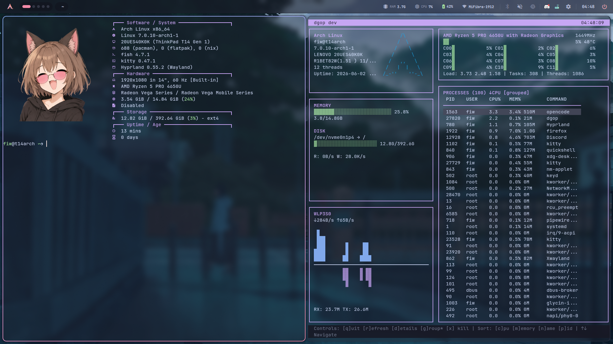
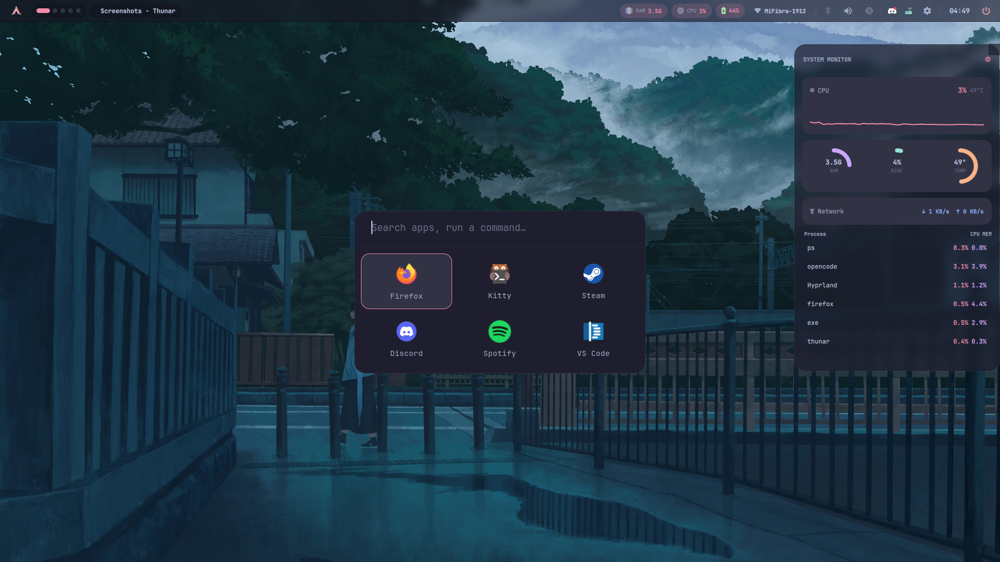
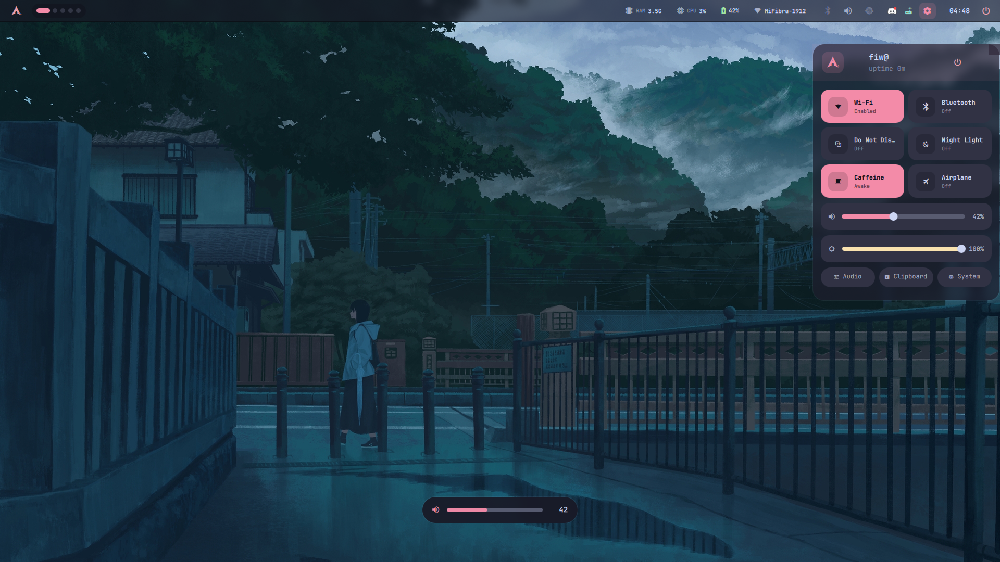
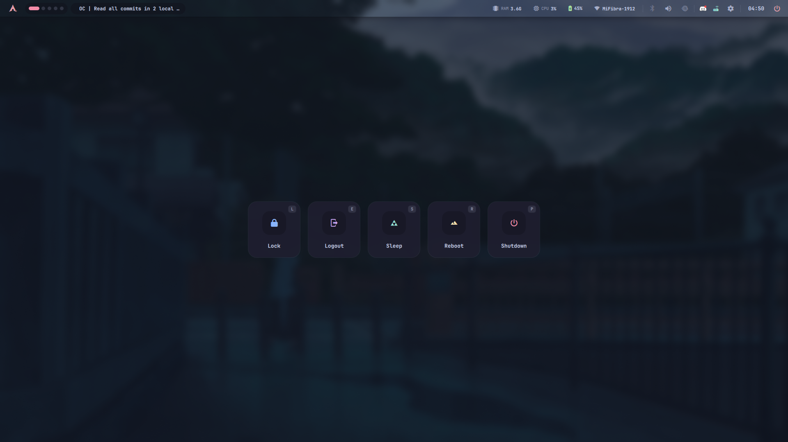
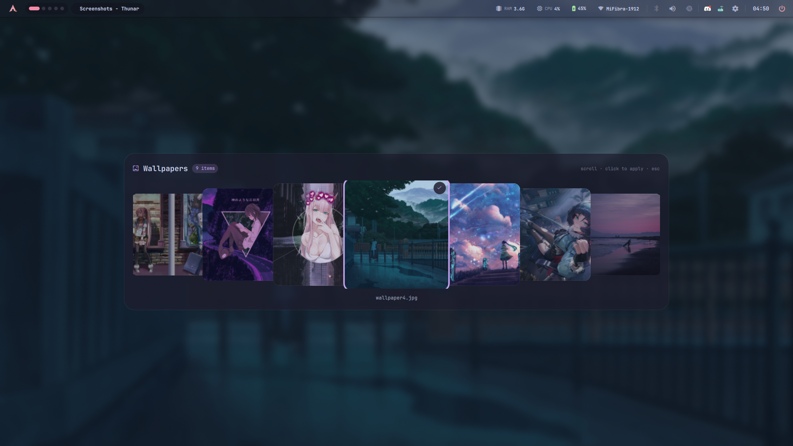
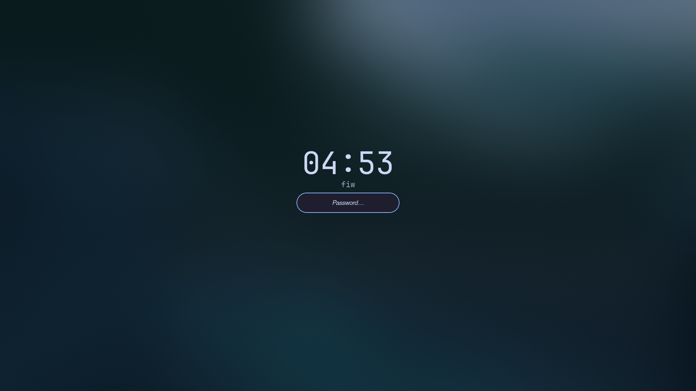

# Moonlit Shell

> Arch Linux · Hyprland · Quickshell · Catppuccin Mocha · Winter 2026

My Hyprland setup rebuilt from scratch — this time with a custom Quickshell shell instead of Waybar, a proper widget bar with real panels, and Catppuccin Mocha soaked into every last config. My daily driver on the ThinkPad T14.

<p align="center">
  
</p>

---

## Why a new rice?

Fi3w0-Hyprland served me well, but Waybar had limits I kept hitting — no proper WiFi connect dialog, no Bluetooth pairing UI, no clipboard history, no wallpaper carousel. Every fix was another hacky script.

So I tore it all down and rebuilt on Quickshell — a Qt6/QML shell framework that lets me write the bar and panels like an app, not a config. The result is cleaner, faster, and everything works through IPC instead of shell scripts racing each other.

---

## Screenshots

<p align="center">
  
  <br><i>Rofi launcher + fastfetch system info</i>
</p>

<p align="center">
  
  <br><i>Quick settings panel with volume and brightness sliders</i>
</p>

<p align="center">
  
  <br><i>Power menu — Lock, Logout, Sleep, Reboot, Shutdown</i>
</p>

<p align="center">
  
  <br><i>Wallpaper carousel with momentum scrolling</i>
</p>

<p align="center">
  
  <br><i>Hyprlock with frosted glass blur over the current wallpaper</i>
</p>

---

## What's Inside

```
.config/
├── hypr/              Hyprland — split configs, gradient borders, frosted blur
│   └── scripts/
│       └── lock.sh    Hyprlock wrapper (reads current wallpaper for blur)
├── quickshell/        The bar + 12 panels
│   ├── bar/           Workspaces, tray, stats, clock
│   └── panels/        QS, audio, wifi, bt, power, calendar,
│                      sysmon, clipboard, wallpaper picker, OSD, toasts
├── kitty/             Terminal — catppuccin palette, 42% opacity
├── rofi/              Launcher with pinned apps + quicklinks + file search
├── fish/              Shell — frozen theme, aliases
├── nvim/              Editor — catppuccin, lazy.nvim
├── ranger/            File manager — miller columns, devicons, catppuccin
├── fastfetch/         System info
├── dgop/              System monitor
├── Thunar/            File manager actions + keybinds
├── keyd/              Keyboard remapping (meta layer)
├── gtk-3.0/           GTK theming
└── gtk-4.0/           GTK theming
```

---

## What the Bar Does

A Quickshell bar that's more functional than most DEs I've used:

| Panel | What it does |
|-------|-------------|
| **Quick Settings** | Toggles for WiFi, Bluetooth, DND, Night Light, Caffeine, Airplane mode. Volume + brightness sliders with live OSD |
| **Audio** | MPRIS now-playing with seek bar, play/pause/skip, master volume, mic level |
| **WiFi** | Scan nearby networks, connect with password dialog, signal strength bars |
| **Bluetooth** | Paired device list, scan, connect/disconnect, power toggle |
| **Power** | Lock, Logout, Sleep, Reboot, Shutdown — all with keyboard shortcuts |
| **System Monitor** | CPU sparkline, RAM/DISK/TEMP ring charts, network throughput, top processes |
| **Calendar** | Full month grid + live clock + now-playing widget + notification history |
| **Clipboard** | cliphist history with copy-to-clipboard and clear |
| **Wallpaper Picker** | Circular carousel with momentum scrolling, click to apply via awww |
| **OSD** | Volume and brightness popups triggered by any source (keys, sliders, scripts) |

The bar itself shows workspaces (pill for active, dot for occupied), current window title, system tray with styled context menus, and real-time stats pulled from /proc/sysfs.

---

## Stack

| Layer | Tool |
|-------|------|
| Compositor | Hyprland 0.55 |
| Bar / Shell | Quickshell (QML) |
| Launcher | Rofi |
| Terminal | Kitty |
| Editor | Neovim (lazy.nvim) |
| File Manager | Thunar + Ranger |
| Lock Screen | Hyprlock (frosted glass, live wallpaper) |
| Login | SDDM (catppuccin-mocha-mauve) |
| Audio | PipeWire + WirePlumber |
| Theme | Catppuccin Mocha |
| Font | JetBrainsMono Nerd Font Mono |
| Icons | Papirus-Dark |
| Cursor | Bibata-Modern-Classic |

---

## Keybinds

| Key | Action |
|-----|--------|
| `SUPER` + `Q` | Kitty |
| `SUPER` + `Space` | Rofi launcher |
| `SUPER` + `B` | Wallpaper picker |
| `SUPER` + `Shift` + `B` | Random wallpaper |
| `SUPER` + `1`–`4` | Workspaces |
| `SUPER` + `F` | Fullscreen |
| `SUPER` + `W` | Close window |
| `SUPER` + `Tab` | Cycle windows |
| `SUPER` + `P` | Toggle float |
| `ALT` + `S` | Screenshot region → clipboard |
| `ALT` + `D` | Screenshot full → clipboard |

---

## Install

Not a copy-paste job — read the guide.

→ **[MANUAL-INSTALL.md](MANUAL-INSTALL.md)**

Quick overview:

```bash
git clone https://github.com/Fi3w0/Moonlit-shell.git
cd Moonlit-shell

# Install packages (Arch + AUR)
# → see MANUAL-INSTALL.md for the full pacman/yay list

# Deploy
cp -r .config/* ~/.config/
cp -r .icons/Bibata-Modern-Classic ~/.icons/
cp -r Wallpapers/ ~/Pictures/Wallpapers/
sudo cp .config/keyd/default.conf /etc/keyd/default.conf && sudo keyd reload
```

> **Note:** These configs assume a single laptop display (ThinkPad T14, 1920x1080, 1x scale), PipeWire audio, and NetworkManager. Adjust monitors, interface names, and paths before applying.

---

## Compared to Fi3w0-Hyprland

- **Waybar → Quickshell** — went from JSON config hell to writing actual QML panels with real state management
- **swww → awww** — animated wallpapers with grow transitions and proper GIF support
- **No more SwayNC** — notifications are now native to Quickshell with a toast system
- **Bluetooth/WiFi actually work** — proper connect dialogs instead of hoping nmcli scripts don't fail
- **SDDM + GTK themed** — the rice starts at the login screen now, not just after login

---

## Notes

- The bar polls `/proc` and `sysfs` directly — no external monitoring daemon needed
- Hyprlock reads your current wallpaper from cache so it always shows what you left on screen, blurred into frosted glass
- Caffeine mode inhibits idle → no accidental suspend during presentations or long downloads
- nightLight toggles `hyprsunset -t 4500` for warm color at night
- Airplane mode calls `rfkill block all` — make sure `rfkill` is installed if you use it
- These are my dots, tailored to my workflow. Steal what you like, adapt the rest. That's how I learned too

---

## License

[GPLv3](LICENSE) — explore, fork, break things, make it yours.
