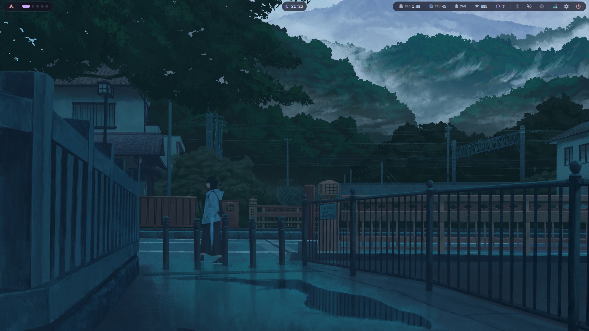
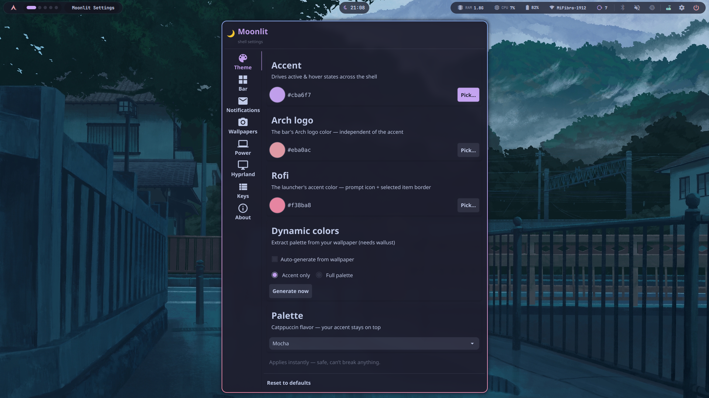
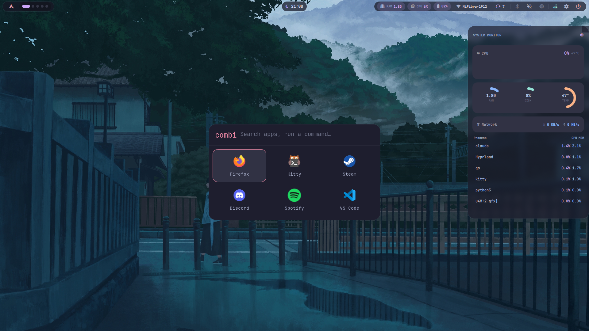
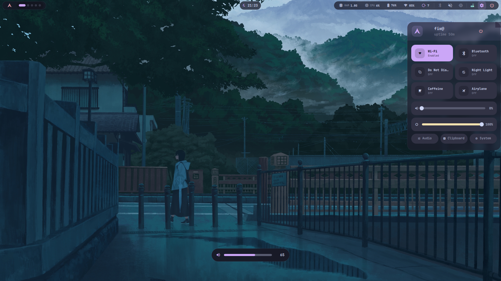
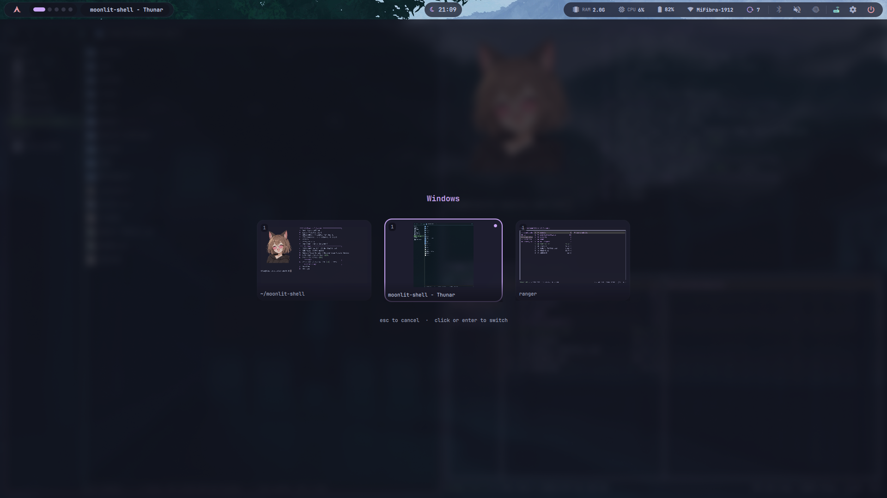
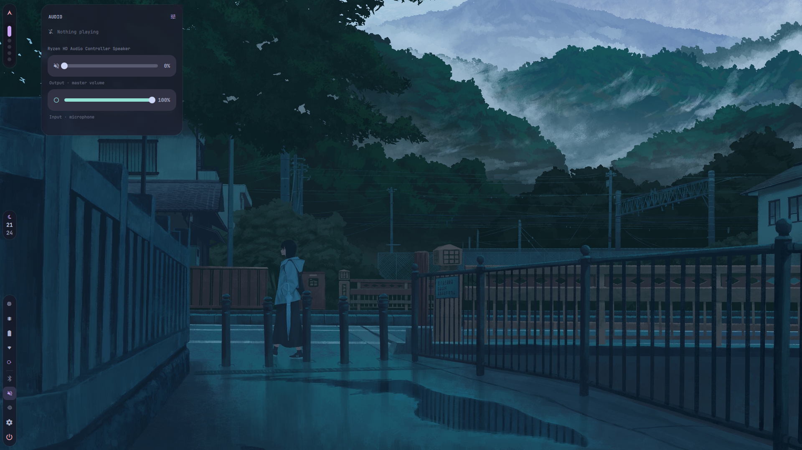
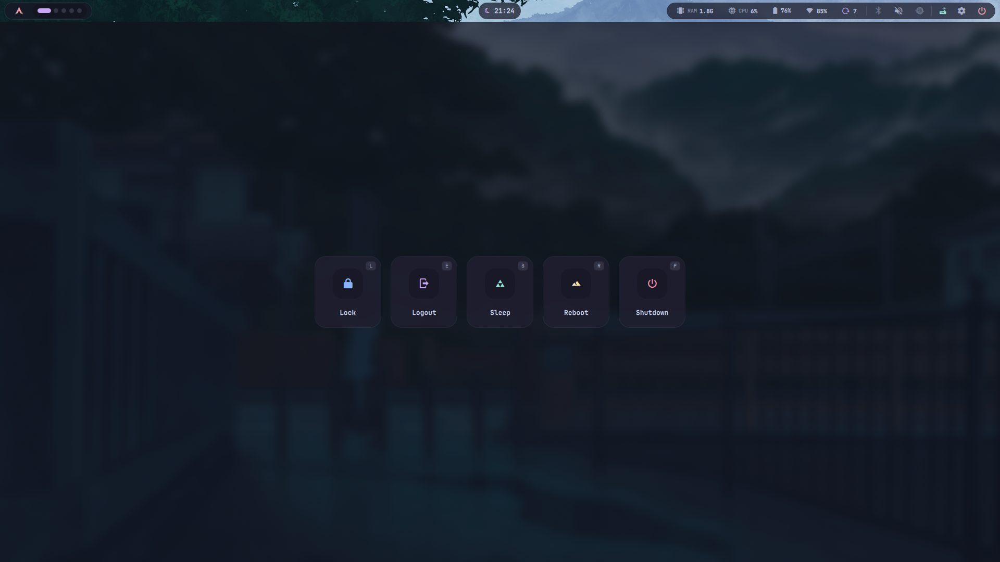

<div align="center">

# 🌙 Moonlit Shell

**A handcrafted Arch Linux desktop, built on Hyprland and a custom Quickshell interface.**

<br>

[](https://archlinux.org)
[](https://hyprland.org)
[](https://wayland.freedesktop.org)
[](https://quickshell.outfoxxed.me)

[](https://catppuccin.com)
[](LICENSE)
[](#status--roadmap)

<br>



</div>

---

## Overview

Moonlit Shell is a complete, cohesive desktop rather than a pile of glued-together scripts. The bar and every panel are written like a real application in Quickshell (a Qt6/QML shell framework) and talk to the system over IPC, so nothing races and nothing breaks in surprising ways. From the SDDM login to the lock screen to the wallpaper carousel, every surface shares one theme and is tuned for a calm, nocturnal workflow.

It ships with its own settings app, **Moonlit Settings** — a standalone GUI for the accent color, palette, bar layout, Hyprland behavior, and keybinds, all applied live with no QML editing required. Nothing here is a static rice you fork once and never touch again; it is meant to be reconfigured.

It is my daily driver on a ThinkPad T14, rebuilt from the ground up after my old Waybar setup kept hitting walls: no proper WiFi dialog, no Bluetooth pairing UI, no clipboard history, no wallpaper picker. Quickshell let me solve all of that properly, once.

---

## Highlights

- **Custom Quickshell bar** with workspaces, window title, a styled system tray, and live stats read straight from `/proc` and `sysfs`, no external daemon. Dockable to the top, left, or right edge, in either a floating-islands or classic-solid style.
- **Twelve real panels**, including full WiFi connect, Bluetooth pairing, clipboard history, an audio/MPRIS hub, a system monitor, and a wallpaper carousel.
- **A Mission-Control-style window overview** (`Alt`+`Tab`) — live thumbnails of every open window in a grid, click or arrow-key to switch.
- **Moonlit Settings**, a standalone Go/Fyne app for theming the entire shell live: accent color, Catppuccin palette (Mocha/Macchiato/Frappé/Latte), wallpaper-driven color extraction via `wallust`, bar layout, Hyprland gaps/blur/animations, and a full keybind editor with conflict detection.
- **Frosted glass everywhere**, Hyprland blur flowing through the bar, panels, Thunar, and Hyprlock over your live wallpaper.
- **Wallpaper carousel** with momentum scrolling, applied instantly via `awww` and remembered across reboots.
- **Automated installer** with Minimal, Developer, and Full presets, plus a safe `--update` mode for pulling in new dotfile versions without clobbering your changes (see [Installation](#installation)).

---

## Moonlit Settings

<p align="center">
  
</p>

Every visual and behavioral knob in the shell runs through one JSON file, `~/.config/moonlit/config.json`, which Quickshell watches and reloads live — no restart, no QML editing. **Moonlit Settings** is the GUI for it: eight tabs (Theme, Bar, Notifications, Wallpapers, Power, Hyprland, Keys, About), a first-run wizard, auto-backups before every save, and import/export so you can carry a config between machines. It installs to `~/.local/bin`, shows up in Rofi, and opens with `SUPER`+`,`.

Changes to theme and bar settings apply instantly and can't break anything. Deeper Hyprland changes (gaps, blur, animations) go through an explicit **Apply** step with a warning, since those touch `hyprctl reload` directly.

---

## Gallery

<p align="center">
  
  <br><i>Rofi launcher and the live system monitor panel</i>
</p>

<p align="center">
  
  <br><i>Quick settings panel with volume/brightness sliders and the OSD popup</i>
</p>

<p align="center">
  
  <br><i>Mission-Control-style window overview (Alt+Tab), live thumbnails included</i>
</p>

<p align="center">
  
  <br><i>The bar docked to the left edge instead of the top, with the audio panel open</i>
</p>

<p align="center">
  
  <br><i>Power menu with Lock, Logout, Sleep, Reboot, Shutdown</i>
</p>

---

## The Bar &amp; Panels

A Quickshell bar that is more functional than most full desktop environments I have used.

| Panel | What it does |
|-------|--------------|
| **Quick Settings** | Toggles for WiFi, Bluetooth, DND, Night Light, Caffeine, and Airplane mode, plus volume and brightness sliders with live OSD |
| **Audio** | MPRIS now-playing with seek bar, play/pause/skip, master volume, and mic level |
| **WiFi** | Scan nearby networks, connect with a password dialog, signal strength bars |
| **Bluetooth** | Paired device list, scan, connect/disconnect, power toggle |
| **Power** | Lock, Logout, Sleep, Reboot, Shutdown with keyboard shortcuts |
| **System Monitor** | CPU sparkline, RAM/Disk/Temp ring charts, network throughput, top processes |
| **Calendar** | Full month grid, live clock, now-playing widget, notification history |
| **Clipboard** | `cliphist` history with copy-to-clipboard and clear |
| **Wallpaper Picker** | Circular carousel with momentum scrolling, click to apply via `awww` |
| **OSD** | Volume and brightness popups triggered by any source (keys, sliders, scripts) |
| **Window Overview** | `Alt`+`Tab` — live thumbnail grid of every open window across every workspace, click or arrow-key to switch |

The bar itself shows workspaces (a pill for the active one, a dot for occupied), the current window title, a system tray with styled context menus, and real-time stats. It can be docked to the top, left, or right edge, and switched between a floating-islands or classic-solid style — all from Moonlit Settings, live.

---

## Tech Stack

| Layer | Tool |
|-------|------|
| Compositor | Hyprland 0.55 |
| Bar / Shell | Quickshell (QML) |
| Launcher | Rofi |
| Terminal | Kitty |
| Editor | Neovim (lazy.nvim) |
| File Manager | Thunar and Ranger |
| Lock Screen | Hyprlock (frosted glass, live wallpaper) |
| Login | SDDM (catppuccin-mocha-mauve) |
| Audio | PipeWire and WirePlumber |
| Theme | Catppuccin (Mocha/Macchiato/Frappé/Latte, live-switchable) |
| Font | JetBrainsMono Nerd Font Mono |
| Icons | Moonlit-Terminal for GTK/Thunar, Papirus-Dark fallback |
| Cursor | Bibata-Modern-Classic |

---

## Keybinds

| Key | Action |
|-----|--------|
| `SUPER` + `Q` | Kitty |
| `SUPER` + `Space` | Rofi launcher |
| `SUPER` + `,` | Moonlit Settings |
| `SUPER` + `B` | Wallpaper picker |
| `SUPER` + `Shift` + `B` | Random wallpaper |
| `SUPER` + `1`–`4` | Switch workspace |
| `SUPER` + `F` | Fullscreen |
| `SUPER` + `W` | Close window |
| `SUPER` + `Tab` | Cycle windows |
| `SUPER` + `P` | Toggle float |
| `ALT` + `Tab` | Window overview (live thumbnails, click/arrows to switch) |
| `ALT` + `.` | Emoji picker |
| `ALT` + `/` | Keybinds cheatsheet |
| `ALT` + `S` | Screenshot region to clipboard |
| `ALT` + `D` | Screenshot full to clipboard |

---

## Installation

> **AMD / Intel GPUs only** for now. NVIDIA is not tested with these dots.

### Automated (experimental)

An installer handles packages, services, themes, and dotfiles for you:

```bash
git clone https://github.com/Fi3w0/Moonlit-shell.git
cd Moonlit-shell
./install.sh            # pick a tier; add --progress for a progress-bar UI
```

It asks for `sudo` up front, shows the full package and action list to confirm before touching anything, backs up any configs it overwrites, and logs every command to `~/.cache/moonlit/install-*.log`. Pick a tier:

| Tier | What you get |
|------|--------------|
| **Minimal** | Hyprland and Quickshell desktop, SDDM (no theme) |
| **Developer** | Minimal plus VS Code, Neovim config, Ranger, dgop |
| **Full** ★ | Everything plus the Catppuccin SDDM theme and Discord/Steam/Spotify |

### Updating

Already installed and pulled a newer version of the repo? Don't just re-run a full install — use update mode instead:

```bash
git pull
./install.sh --update
```

This only refreshes dotfiles (no packages, no tier menu) for whichever config categories you already have installed. It's safe to run any time: any file you never touched by hand gets brought forward to the new version automatically, and any file you *did* customize is left completely alone — the new version is saved next to it as `<file>.moonlit-new` so you can `diff` and merge whatever you want, same idea as pacman's `.pacnew`. Your accent, palette, keybinds, and everything else set through Moonlit Settings is untouched either way — that lives in `~/.config/moonlit/`, which the installer never writes to.

The very first `--update` after pulling this feature in is the one exception: since there's no history yet of what was originally shipped vs. what you've since edited, it plays it safe and treats every changed file as "possibly yours," so you may see more `.moonlit-new` files than usual that one time. Every update after that is precise.

### Manual

Prefer to do it by hand, or running NVIDIA? It is not a copy-paste job, so read the guide.

> **[MANUAL-INSTALL.md](MANUAL-INSTALL.md)**

**Multi-monitor:** Quickshell spawns a bar and panels on every connected screen automatically, and the shipped `monitors.conf` is a universal wildcard (any output, preferred mode, scale 1), so external displays work out of the box. The installer detects your monitors and can write explicit per-display scale lines if you want HiDPI handling. These configs otherwise assume PipeWire audio and NetworkManager; adjust interface names if yours differ.

---

## Project Layout

```
.config/
├── hypr/              Hyprland: split configs, gradient borders, frosted blur
│   └── scripts/
│       └── lock.sh    Hyprlock wrapper (reads current wallpaper for blur)
├── quickshell/        The bar and 12 panels
│   ├── bar/           Workspaces, tray, stats, clock
│   └── panels/        QS, audio, wifi, bt, power, calendar,
│                      sysmon, clipboard, wallpaper picker, OSD, toasts
├── kitty/             Terminal: catppuccin palette, 42% opacity
├── rofi/              Launcher with pinned apps, quicklinks, file search
├── fish/              Shell: frozen theme, aliases
├── nvim/              Editor: catppuccin, lazy.nvim
├── ranger/            File manager: miller columns, devicons, catppuccin
├── fastfetch/         System info
├── dgop/              System monitor
├── Thunar/            File manager actions and keybinds
├── keyd/              Keyboard remapping (meta layer)
├── gtk-3.0/           GTK theming
└── gtk-4.0/           GTK theming
```

A few behaviors worth knowing:

- The bar polls `/proc` and `sysfs` directly, with no external monitoring daemon.
- Caffeine mode inhibits idle so there is no accidental suspend during presentations or long downloads.
- Night Light toggles `hyprsunset -t 4500` for warm color at night.
- Airplane mode calls `rfkill block all`; the `rfkill` tool ships with `util-linux`, so it is always available.

---

## Status &amp; Roadmap

Moonlit Shell is under active development and is my daily driver, but it is still my personal dotfiles before it is a polished product — expect the occasional rough edge, and treat the installer as experimental on anything but a fresh Arch install.

What's shipped: the full Quickshell bar and panel set, the Moonlit Settings app (theme, bar, notifications, wallpapers, power, Hyprland, keybinds, import/export), the window overview, and a `--update`-safe installer.

Still on the list:

- A couple more Rofi modes (calculator, expanded clipboard search) — the emoji picker and keybind cheatsheet are already in.
- Wider multi-monitor testing for the window overview; it's built to handle it but has only been verified on a single-display machine so far.
- A showcase video of the desktop in motion.
- Ongoing updates to track new Arch and Hyprland releases.

---

## License

Released under the [GPLv3](LICENSE). Explore it, fork it, break things, and make it yours.

<div align="center">
<br>
<sub>These are my dots, tailored to my workflow. Steal what you like, adapt the rest. That is how I learned too. 🌙</sub>
</div>
